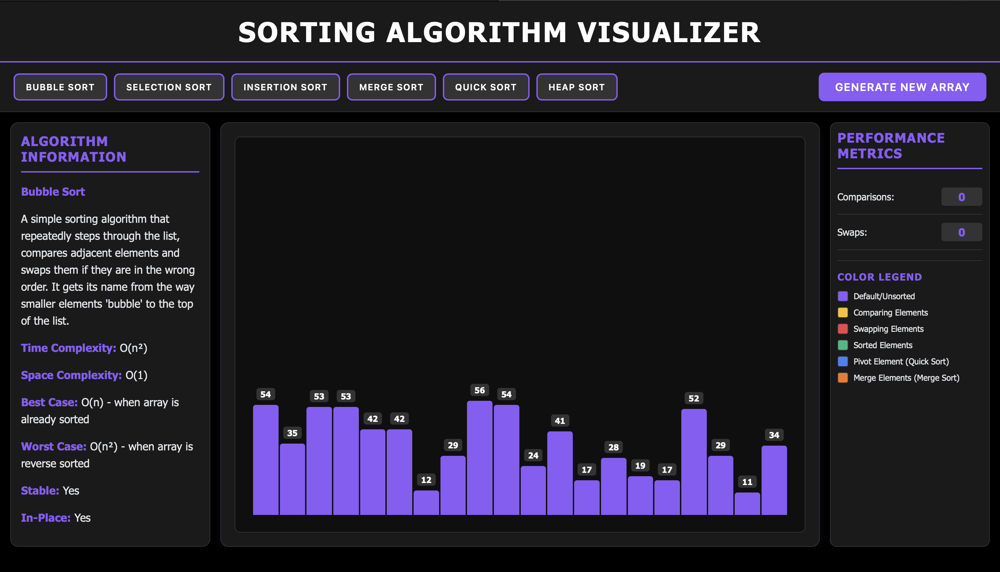

# Sorting Algorithm Visualizer

A comprehensive, interactive web application that visualizes different sorting algorithms in real-time with educational features and responsive design.


## 🎯 Project Overview

This Sorting Algorithm Visualizer is an educational tool designed to help users understand how different sorting algorithms work by providing real-time visual representations of the sorting process. The application features a modern, responsive design with a dark theme and comprehensive educational content.

## ✨ Features


### 🎨 **Interactive Visualization**
- **Real-time sorting animations** with color-coded bars
- **Value display** on each bar showing actual numbers
- **Smooth transitions** and animations for better understanding
- **Responsive design** that works on desktop, tablet, and mobile devices

### 📊 **Educational Information**
- **Detailed algorithm descriptions** explaining how each sorting method works
- **Time and space complexity** information for each algorithm
- **Best and worst case scenarios** with explanations
- **Stability and in-place sorting** characteristics

### 📈 **Performance Metrics**
- **Real-time comparison counter** showing number of comparisons made
- **Swap counter** tracking the number of swap operations
- **Color legend** explaining what each color represents during sorting

### 🎛️ **User Controls**
- **Generate new arrays** with random values
- **Select from 6 different sorting algorithms**
- **Responsive layout** that adapts to different screen sizes
- **Touch-friendly interface** for mobile devices

## 🚀 Supported Algorithms

### 1. **Bubble Sort**
- **Time Complexity**: O(n²)
- **Space Complexity**: O(1)
- **Best Case**: O(n) when array is already sorted
- **Worst Case**: O(n²) when array is reverse sorted
- **Stable**: Yes
- **In-Place**: Yes

### 2. **Selection Sort**
- **Time Complexity**: O(n²)
- **Space Complexity**: O(1)
- **Best Case**: O(n²) - same as worst case
- **Worst Case**: O(n²) - same as best case
- **Stable**: No
- **In-Place**: Yes

### 3. **Insertion Sort**
- **Time Complexity**: O(n²)
- **Space Complexity**: O(1)
- **Best Case**: O(n) when array is already sorted
- **Worst Case**: O(n²) when array is reverse sorted
- **Stable**: Yes
- **In-Place**: Yes

### 4. **Merge Sort**
- **Time Complexity**: O(n log n)
- **Space Complexity**: O(n)
- **Best Case**: O(n log n) - same as worst case
- **Worst Case**: O(n log n) - same as best case
- **Stable**: Yes
- **In-Place**: No

### 5. **Quick Sort**
- **Time Complexity**: O(n log n)
- **Space Complexity**: O(log n)
- **Best Case**: O(n log n) when pivot divides array evenly
- **Worst Case**: O(n²) when pivot is always smallest/largest
- **Stable**: No
- **In-Place**: Yes

### 6. **Heap Sort**
- **Time Complexity**: O(n log n)
- **Space Complexity**: O(1)
- **Best Case**: O(n log n) - same as worst case
- **Worst Case**: O(n log n) - same as best case
- **Stable**: No
- **In-Place**: Yes

## 🎨 Color Coding System

The visualization uses a comprehensive color system to help users understand what's happening:

- **🟣 Purple**: Default/Unsorted elements
- **🟡 Yellow**: Elements being compared
- **🔴 Red**: Elements being swapped
- **🟢 Green**: Elements that are sorted
- **🔵 Blue**: Pivot element (used in Quick Sort)
- **🟠 Orange**: Merge elements (used in Merge Sort)

## 🛠️ Tech Stack

### **Frontend Technologies**
- **HTML5**: Semantic markup and structure
- **CSS3**: 
  - Flexbox and Grid for responsive layouts
  - CSS animations and transitions
  - Custom properties (CSS variables)
  - Media queries for responsive design
- **Vanilla JavaScript (ES6+)**:
  - Async/await for smooth animations
  - Event handling and DOM manipulation
  - Responsive design with dynamic sizing
  - Object-oriented programming principles

### **Key Features**
- **Responsive Design**: Works on all device sizes
- **Modern CSS**: Grid layouts, flexbox, and animations
- **Pure JavaScript**: No external dependencies
- **Performance Optimized**: Efficient rendering and animations
- **Accessibility**: Keyboard navigation and screen reader support

## 📱 Responsive Design

The application is fully responsive and adapts to different screen sizes:

- **Desktop (1024px+)**: Three-column layout with full features
- **Tablet (768px-1024px)**: Optimized layout with proportional columns
- **Mobile (768px-)**: Single-column layout with stacked panels
- **Small Mobile (480px-)**: Compact design with touch-friendly controls

## 🚀 Getting Started

### Prerequisites
- A modern web browser (Chrome, Firefox, Safari, Edge)
- No additional software installation required

### Installation & Running

1. **Clone the repository**
   ```bash
   git clone https://github.com/yourusername/sorting-algorithm-visualizer.git
   cd sorting-algorithm-visualizer
   ```

2. **Run the application**
   ```bash
   # Using Python (if installed)
   python3 -m http.server 8000
   
   # Using Node.js (if installed)
   npx http-server
   
   # Or simply open index.html in your browser
   ```

3. **Access the application**
   - Open your browser and navigate to `http://localhost:8000`
   - Or double-click `index.html` to open directly

## 🎮 How to Use

1. **Generate Array**: Click "Generate New Array" to create a random array
2. **Select Algorithm**: Choose any of the 6 sorting algorithms
3. **Watch Visualization**: Observe the sorting process with color-coded animations
4. **Monitor Metrics**: Track comparisons and swaps in real-time
5. **Learn**: Read detailed information about each algorithm

## 📁 Project Structure

```
sorting-algorithm-visualizer/
├── index.html          # Main HTML file
├── style.css           # CSS styles and responsive design
├── script.js           # JavaScript functionality and algorithms
├── README.md           # Project documentation
└── assets/             # Additional resources (if any)
```

## 🔧 Customization

### Adding New Algorithms
1. Add the algorithm function to `script.js`
2. Update the `algorithmInfo` object with algorithm details
3. Add the algorithm button to `index.html`
4. Update the event listener in the JavaScript

### Modifying Styles
- Edit `style.css` to change colors, layout, or animations
- Update CSS variables for easy theme customization
- Modify responsive breakpoints as needed

## 🤝 Contributing

Contributions are welcome! Please feel free to submit a Pull Request. For major changes, please open an issue first to discuss what you would like to change.

### Contributing Guidelines
1. Fork the repository
2. Create a feature branch (`git checkout -b feature/AmazingFeature`)
3. Commit your changes (`git commit -m 'Add some AmazingFeature'`)
4. Push to the branch (`git push origin feature/AmazingFeature`)
5. Open a Pull Request

## 📄 License

This project is licensed under the MIT License - see the [LICENSE](LICENSE) file for details.

## 🙏 Acknowledgments

- Original concept inspired by various sorting visualizers
- Educational content based on standard computer science curriculum
- Color scheme and design principles from modern UI/UX practices


**Made with ❤️ for educational purposes**

*This project helps students and developers understand sorting algorithms through interactive visualization.*


